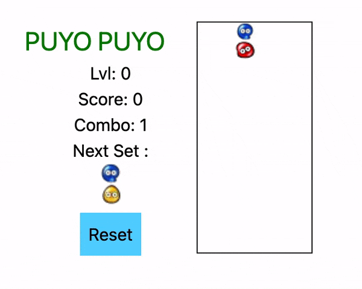

# PuyoPuyo game

## Getting Started

Was make with node v18.15.0

Then run the development server:

```bash
npm install
npm run dev
```



Open [http://localhost:3000](http://localhost:3000) with your browser to play a game of puyopuyo.

## Command

You can move with the arrow keyboard

**Key down** move the set of slim at the bottom

**Key A** rotate the set of slim to the left

**Key Z** rotate the set of slim to the right


You can play the game here [PuyoPuyo](https://puyopuyo.vercel.app/)


## Test

```bash
npm run test
```
